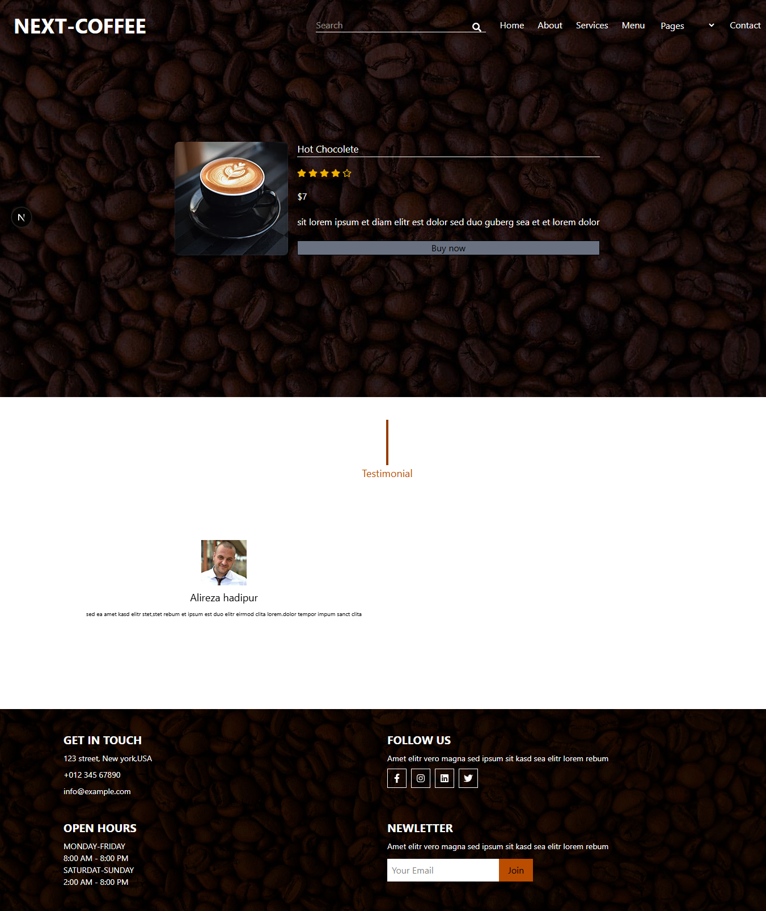
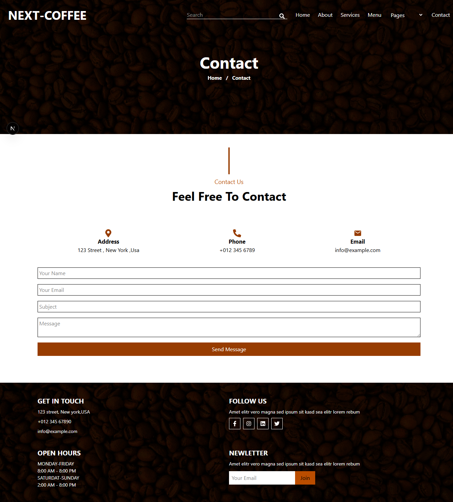

# Coffee Shop Website (Next.js Project)

This is my first Next.js project, a Coffee Shop website that showcases services, menus, booking, and search functionalities. The project demonstrates how to fetch data using SSG (Static Site Generation) and ISR (Incremental Static Regeneration), as well as SSR (Server-Side Rendering) for dynamic pages.

The site uses a JSON file as the database (db.json) to store all data, including services, menu items, bookings, and other content

---

## 📸 Screenshots

Here are some key pages of the application:

### 🏠 Home Page  
Landing page of the website.


---

### 🛍 detailMenuItem Page  
Displays detail of any items of menu.



---

### 📂 Contact Page
display how contact us




---

## 🎯 Project Goals

The main goal of this project was to build a functional and responsive Coffee Shop website while learning how to use different Next.js data fetching strategies (SSG, ISR, SSR).
- Create a services section with static data using SSG.
- Implement a menu section that updates automatically every few hours using ISR.
- Add a booking form and handle submissions.
- Implement a search functionality for menu items.
- Display product details dynamically using SSR.

---

## 🛍️ Features 

### Services

- The Services section fetches data from the JSON file using SSG.
- The data includes multiple entries with information such as id, title, icon, and img.
- Static generation ensures fast loading and SEO-friendly pages.

### Menu

- The Menu section is implemented using ISR to revalidate the data every few hours.
- This allows the menu to update automatically without redeploying the site.
- Menu items are stored in the JSON file and fetched from there.
- 
### Booking

- The Booking section includes a form where users can submit their reservation details.
- Submitted data is stored in the JSON database.
- The form contains fields such as name, email, date, time, and number of persons.

### Search

- A search functionality is implemented for the Menu section.
- Users can search by title or type of the menu item.
- Search results are rendered using SSR, ensuring real-time data fetching.

### Product Details

- Individual product pages use SSR with the product id.
- Detailed information for each menu item is fetched and displayed dynamically.

---

## 🧠 What I Learned

- How to use Next.js data fetching methods: SSG, ISR, and SSR.
- How to handle dynamic routes and fetch data based on id.
- How to work with JSON as a simple database and fetch data using fetch API.
- How to implement forms and manage user input.
- How to build responsive layouts with Tailwind CSS.
---


## 💻 Technologies Used

- **Next.js** – React framework for SSG, SSR, and ISR
- **TailwindCSS** For responsive and modern styling
- **React Icons** For service and UI icons
- **JSON** Used as a local database (db.json)
- **Fetch API / Axios** For fetching data from JSON


---

## 🧰 How to Use / Run Locally

1. Clone the repository:

```bash
git clone https://github.com/Mahlagha2211/CoffeeWebsite.git
npm install
npm run server
